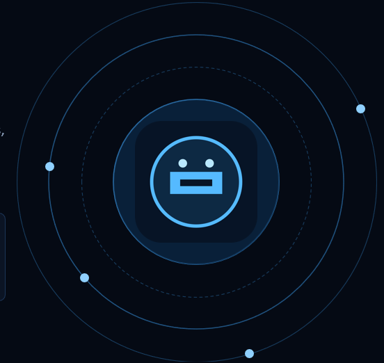

# Bumblebee Desktop Assistant

An Iron Man–inspired holographic orb built with **Next.js**, **Three.js**, and **MediaPipe** hand tracking — control it with your bare hands through your webcam.

> This is the open-source interface of [the original ULTRON project](https://github.com/ZAHEER-R/ultron), rebranded as Bumblebee for this workspace.



[preview1](p1.png)
[preview2](p2.png)
[preview3](p2.1.png)
[preview4](p4.png)
[preview5](p3.png)
[preview6](p5.png)

## Getting started

Create a Google AI Studio API key, then paste it into `GEMINI_API_KEY` in the
root `.env.local` file. The file is ignored by Git and the key is only used by
the server-side chat endpoint. Restart the app after adding the key.

```bash
npm install
npm run dev
```

`npm run dev` starts the Next.js development server and opens the Electron
desktop window after the server is ready. Use `npm run web` to run only the
browser version at [http://localhost:3000](http://localhost:3000).

## GitHub Pages and mobile

The root `index.html` is a standalone, mobile-ready client with local chat
history, voice input, and an installable offline shell. Publish the repository
root with GitHub Pages, then open the Pages URL over HTTPS and use **Connection
settings** to enter the URL of a separately hosted Bumblebee `/api/chat`
endpoint. Keep `GEMINI_API_KEY` on that server; never put it in `index.html`.

On the API host, set `BUMBLEBEE_ALLOWED_ORIGINS` to the exact Pages origin,
for example `https://your-account.github.io` (comma-separate origins if you
have more than one deployment). The backend can be deployed with any host that
runs this Next.js app and its `/api/chat` route. On mobile, use the browser's
**Add to Home Screen** action to install the Pages app.

The desktop app can open and close the applications in the command allowlist
when asked with commands such as “open Notepad” or “close Chrome.” Closing an
application is not forced, so Windows can preserve unsaved work.

You can also say “write [text] in Notepad” to save and open a note, or “set an
alarm for 7:30 AM” to open the Windows Clock alarm request. Confirm the alarm
is enabled in Clock after it opens. Other supported requests include opening a
known user folder or an existing absolute folder path, creating a folder in
Desktop/Documents/Downloads, calculating basic arithmetic, and opening
Spotify/YouTube search results. Search actions open results; choose a track to
start playback. Bumblebee does not have unrestricted control over arbitrary apps,
and it will not claim it moved files or started playback when it did not.

## Controls

### Mouse / touch

| Input | Action |
| --- | --- |
| Drag | Spin the orb |
| Scroll / pinch | Zoom in & out |

### Hand gestures (webcam)

Click **GESTURES OFF** (or press `G`) and allow camera access, then:

| Gesture | Action |
| --- | --- |
| Pinch (thumb + index) one hand and move it | Spin the orb |
| Pinch with **both** hands, spread apart / bring together | Zoom in / out |

### Keyboard

| Key | Action |
| --- | --- |
| `G` | Toggle hand gestures |
| `R` | Reset the view |
| `+` / `−` | Zoom in / out |

## How it works

- **`lib/orbScene.ts`** — the Three.js scene: layered wireframe shells, a spiral
  inner core, floating code-text sprites, orbiting debris, dust particles, scan
  rings, and a bloom + chromatic-aberration post-processing stack.
- **`lib/handTracker.ts`** — MediaPipe HandLandmarker running on the webcam
  feed. Pinch detection with hysteresis: one pinched hand spins the orb, two
  pinched hands zoom by spreading apart or together.
- **`components/JarvisOrb.tsx`** — the HUD and glue between the scene, the
  tracker, and your inputs.

## License

MIT
